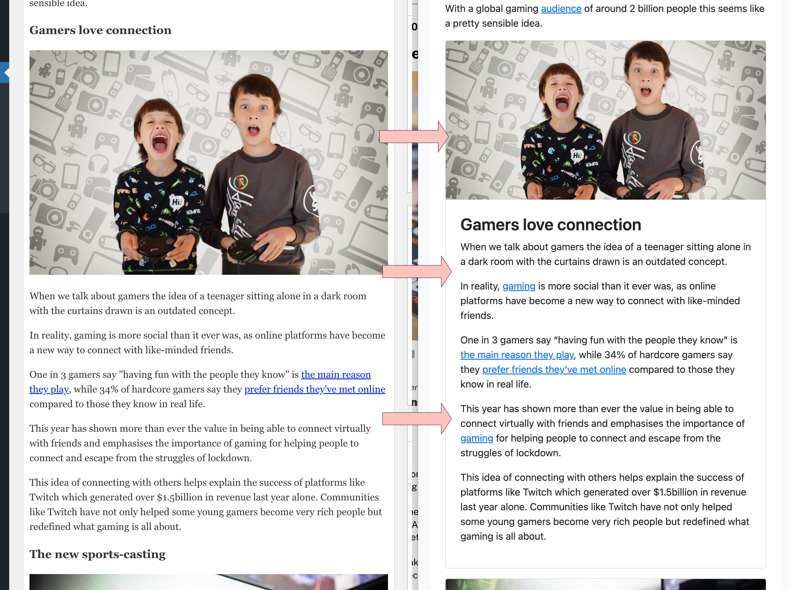

# Context WP Post Segmenter

Tested up to: 5.9.1  
Tags: posts, bootstrap  
Contributors: robertandrews  

## Description

This plugin makes impactful in-article cards from plain article areas denoted by `<h3>` crossheads and paragraph text beneath.

This is an article innovation which builds upon header crossheads, further breaking up posts, making them easier to read than long blocks of text.

When presented as bordered segments, the reader's eye can more easily digest the whole article in sequential chunks.

### Card creation

The code finds H3 content "segments" in posts and wraps them as follows:

* `<section>` for semantic structure.
* Bootstrap classes [`.card`](https://getbootstrap.com/docs/5.0/components/card/) and `.mb-3` applied to `<section>`.
* Segment paragraphs contained in new `div.card-body`, inserted inside `section.card`.

Segments are identified as followed:

* Begin with `<h3>`.
* Include subsequent elements.
* Until either the next `<h3>` or, else, to end of post.

### Image transformation

The plugin does one additional thing. Where an image is found immediately following a `<h3>` element, we move it _above_ the heading, where it is transformed into a [Bootstrap card image](https://getbootstrap.com/docs/5.0/components/card/#images) by means of applying `.card-img-top` to the `img`.

This also _moves_ the image, to above the `<h3>` - even if the author included an image _below_ a `<h3>` in WordPress. This occurs at the front-end, but not the back-end, for two reasons:

1. Images are semantically correct when placed _below_ the `<h3>` which precedes them.
2. In [Bootstrap `.card`s](https://getbootstrap.com/docs/5.0/components/card/), images typically come above titles and `.card-body`, by means of `.card-img-top`.

## Usage

Your WordPress theme must already be Bootstrap-enabled for `.card` borders to be displayed. This plugin does not add Bootstrap CSS to your theme.

Add the plugin to WordPress and activate it.

The plugin code makes use of PHP's DOMDocument, which some observers say is limited and frustrating.

 You are free to use alternate classes, or to style those used here as you see fit.
